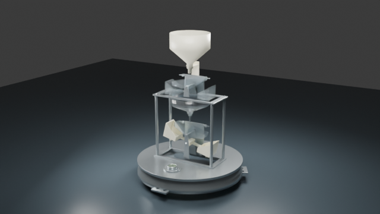

# 双翻斗雨量传感器 · 3D 科普展品

这是一个面向公众的交互式三维科普项目。它把双翻斗雨量传感器的内部结构和工作过程做成了可以直接操作的在线展示，帮助观众理解降水如何经过机械结构转化为电脉冲，再形成雨量读数。

项目支持手机与电脑访问，适合课堂讲解、展览展示和气象科普活动。

[立即体验在线展示](https://sdgsacmljh.github.io/double-tipping-bucket-rain-gauge/) · [查看 GitHub 仓库](https://github.com/sdgsacmljh/double-tipping-bucket-rain-gauge)



*最终模型渲染预览。在线页面支持直接旋转和观察模型。*

## 你可以看到什么

项目把雨量传感器的内部工作过程做成了一个可操作的展示页面。打开后可以

- 拖动模型旋转，使用双指或滚轮缩放，并随时恢复默认视角。
- 点击零件查看名称和科普说明，被选中的部件会高亮显示。
- 播放完整工作原理动画，查看降水从进入仪器到产生读数的过程。
- 开启慢动作，观察翻斗翻转和磁控计数的关键动作。
- 切换内部观察模式，了解漏斗、翻斗和排水结构之间的关系。
- 查看当前阶段、脉冲次数和累计雨量，理解机械动作与电子信号的对应关系。

## 工作原理

展示中的过程可以概括为

`降水 → 漏斗 → 翻斗 → 磁控计数 → 电脉冲 → 雨量读数`

降水进入仪器后，翻斗依次承接和排放水流。计量翻斗完成一次翻转时，联动结构带动磁钢靠近干簧管，干簧管输出一次通断信号，系统把它记录为一次脉冲。

当前演示按每次脉冲 `0.1 mm` 计算雨量，共设置五次脉冲，演示结束时显示 `0.5 mm`。这些数值用于说明计数关系，不能替代具体设备的现场标定结果。

## 当前版本

当前公开版本使用最终模型和完整工作原理动画，重点呈现以下内容

- 翻斗、汇集、节流、排水和磁控计数之间的结构关系。
- 白色翻斗、矩形汇集结构、防虫网和磁控计数组件等最终修订内容。
- 从收集降水到累计雨量的连续演示，以及对应的阶段提示。

项目聚焦结构与原理科普，当前模型按裸机结构展示，未用于制造、检定或现场测量。

## 本地开发

```bash
npm ci
npm run dev
```

## 构建与部署

```bash
npm run build
```

构建结果位于 `dist/`，可用于静态托管。仓库已配置 GitHub Pages 工作流，推送到 `main` 后会自动构建并发布在线展示。

在线地址为

<https://sdgsacmljh.github.io/double-tipping-bucket-rain-gauge/>

## 项目结构

```text
public/models/rain-gauge.glb       # 三维模型与工作原理动画
src/viewer.js                      # 场景、灯光、相机和模型加载
src/animation.js                   # 动画播放、慢动作和脉冲计数
src/components.js                  # 部件识别、高亮和内部观察
src/config.js                      # 动画阶段、部件说明和展示配置
.github/workflows/pages.yml        # GitHub Pages 自动部署
```

开发维护信息见[技术说明](docs/technical-notes.md)。
